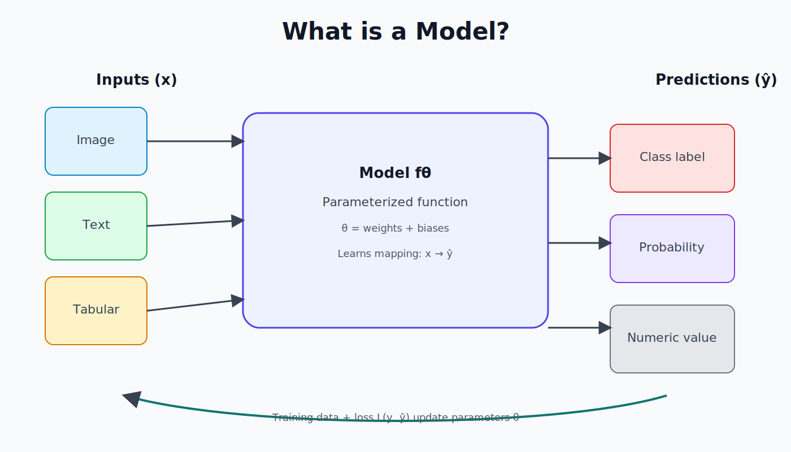

# Introduction to Machine Learning

### From Data to Prediction

---

# What is Machine Learning?

Machine Learning (ML) is a field of AI that enables systems to:

- Learn patterns from data
- Make predictions or decisions
- Improve with experience
- Without being explicitly programmed

Traditional programming:

- Rules + Data → Output

Machine Learning:

- Data + Output → Rules (Model)

---

# Why Machine Learning Matters

ML powers:

- Recommendation systems (Netflix, Amazon)
- Autonomous vehicles
- Fraud detection
- Computer vision
- Natural language processing
- Medical diagnosis

ML is everywhere.

---

# Types of Machine Learning

<div class="columns">
<div>

## 1. Supervised Learning
- Labeled data
- Predict output from input
- Example: spam detection

## 2. Unsupervised Learning
- No labels
- Discover hidden structure
- **Example**: customer segmentation

</div>
<div>

## 3. Reinforcement Learning
- Agent interacts with environment
- Reward-based learning

</div>
</div>

---

# Supervised Learning

Dataset:

(x₁, y₁)
(x₂, y₂)
…
(xₙ, yₙ)

Goal: Learn a function

f(x) ≈ y

Two main tasks:

- Regression → continuous output
- Classification → discrete output

---

# Example: Linear Regression

Model:

ŷ = w₀ + w₁x

We want to minimize error:

Loss = (y - ŷ)²

Learning = Finding optimal weights ```w```

---

# What is a Model?

<div class="columns">
<div>

A model is:

- A mathematical function
- Parameterized by weights
- That maps input → output

Example:
- Linear model
- Decision tree
- Neural network

</div>
<div>



</div>
</div>

---

# The Learning Process

1. Collect data
2. Split into train / test
3. Choose model
4. Define loss function
5. Optimize parameters
6. Evaluate performance

---

# Loss Function

The loss function measures how wrong we are.

Examples:

Regression:

Mean Squared Error (MSE)

Classification:

Cross-Entropy Loss

Learning = minimizing loss

---

# Optimization

We minimize loss using:

## Gradient Descent

Update rule:

w = w - η ∇L(w)

Where:
- η = learning rate
- ∇L(w) = gradient

---

# Overfitting vs Underfitting

Underfitting:
- Model too simple
- High bias

Overfitting:
- Model memorizes data
- High variance

Goal:
Balance bias and variance.

---

# Unsupervised Learning

No labels.

Goal:
Find structure in data.

Examples:
- Clustering (K-means)
- Dimensionality reduction (PCA)
- Anomaly detection

---

# Reinforcement Learning

Components:
- Agent
- Environment
- State
- Action
- Reward

Goal:
Maximize cumulative reward.

Used in:
- Robotics
- Game AI
- Control systems

---

# What is Deep Learning?

Deep Learning = ML using neural networks with many layers.

Key ideas:
- Representation learning
- Backpropagation
- Large-scale data
- GPU acceleration

---

# Neural Network (High-Level View)

Each layer:

z = Wx + b
a = activation(z)

Common activations:
- ReLU
- Sigmoid
- Softmax

---

# Machine Learning Pipeline

1. Data collection
2. Data cleaning
3. Feature engineering
4. Model training
5. Validation
6. Deployment
7. Monitoring

ML is iterative.

---

# Evaluation Metrics

Regression:
- MSE
- MAE
- R²

Classification:
- Accuracy
- Precision
- Recall
- F1-score
- ROC-AUC

---

# Ethical Considerations

- Bias in data
- Fairness
- Transparency
- Explainability
- Privacy

ML systems impact society.

---

# Summary

Machine Learning:

- Learns from data
- Optimizes a loss function
- Uses models with parameters
- Requires evaluation and monitoring

It is both:
- Mathematical
- Engineering-driven
- Data-centric

---

# Next Steps

To go further:

- Python + NumPy
- scikit-learn
- PyTorch / TensorFlow
- Real datasets
- Build your first model

---

# Questions?

Thank you!

