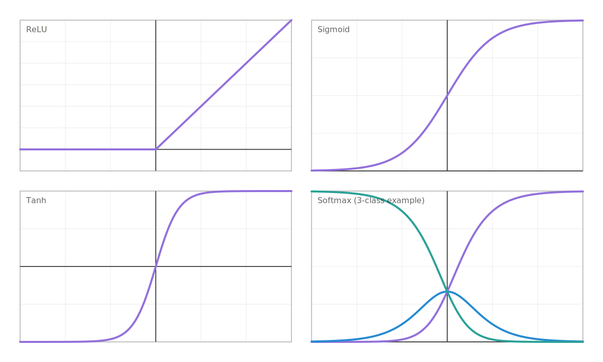

# Introduction to Deep Learning

### Learned Features

---

# What is Deep Learning?

Deep Learning (DL) is a subfield of Machine Learning that uses **neural networks** to:

- Learn representations from raw data
- Solve complex prediction tasks
- Improve with more data and compute

Deep Learning = **many-layer neural networks** + **backpropagation** + **large-scale data**

It learns **features automatically**.

---

# Why Deep Learning Matters

DL powers many modern AI capabilities:

- Vision (object detection, segmentation)
- Speech (ASR, TTS)
- Natural language (translation, chatbots)
- Recommendation and ranking
- Scientific computing (protein, climate, materials)

---

# ML vs DL

Traditional ML (often):

- Hand-crafted features → model → prediction

Deep Learning:

- Raw inputs → **learned features** → prediction

DL shifts effort from feature engineering to:

- Data quality
- Model architecture
- Training and evaluation

---

# The Building Block: Neuron

<div class="columns">
<div>

A neuron computes:

- $z = w^{\top}x + b$
- $a = \sigma(z)$

Where:

- x = input vector
- w = weights
- b = bias
- σ = activation function

</div>
<div>



</div>
</div>

---

# From Neuron to Network

<div class="columns">
<div>

A neural network stacks layers:

- Layer 1: $z_{1} = W_{1}x + b_{1} \rightarrow a_{1} = \sigma(z_{1})$
- Layer 2: $z_{2} = W_{2}a_{1} + b_{2} \rightarrow a_{2} = \sigma(z_{2})$
- ...
- Output: $\hat{y} = f(x)$

</div>
<div>



</div>
</div>

---

# Activation Functions

<div class="columns">
<div>

Activation adds non-linearity.

Common choices:

- ReLU: $\max(0, z)$
- Sigmoid: $\frac{1}{1 + e^{-z}}$
- Tanh
- Softmax (classification output)

Without activation, multiple layers collapse to a linear model.

</div>
<div>



</div>
</div>

---

# What is a Deep Learning Model ?

A DL model is:

- A function with **many parameters**
- Organized in layers
- Trained to minimize a loss

Parameters are typically:

- Millions to billions of weights

---

# The Learning Objective

We choose a **loss function** L that measures error.

We want:

- minimize L(θ)

Where:

- θ = all parameters (weights and biases)

---

# Common Loss Functions

Regression:

- Mean Squared Error (MSE)

Classification:

- Cross-Entropy Loss

Multi-class prediction often uses:

- Softmax + cross-entropy

---

# Training Data Split

We usually split data into:

- Train set: learn parameters
- Validation set: tune hyperparameters
- Test set: final unbiased evaluation

Avoid “peeking” at test data during training.

---

# Forward Pass

Given an input x:

- Compute activations layer by layer
- Produce prediction ŷ
- Compute loss L(y, ŷ)

This is just evaluation of the network.

---

# Backpropagation (Idea)

Backpropagation computes gradients efficiently:

∇θ L(θ)

It uses the chain rule to propagate error from output back to earlier layers.

Result:

- We know how to change weights to reduce loss

---

# Optimization: Gradient Descent

Update rule:

θ = θ - η ∇L(θ)

Where:

- η = learning rate

In practice we use mini-batches:

- SGD (Stochastic Gradient Descent)

---

# SGD and Mini-batches

Instead of using all data each step:

- Sample a batch (e.g., 32 / 128 / 1024 examples)
- Compute gradient on the batch
- Update parameters

Trade-offs:

- Speed vs stability

---

# Modern Optimizers

Common optimizers:

- SGD + Momentum
- Adam / AdamW

Why they help:

- Faster convergence
- Better scaling across parameters

---

# Key Hyperparameters

Training is sensitive to:

- Learning rate (η)
- Batch size
- Number of epochs
- Weight decay (L2)
- Dropout rate

A good baseline is often:

- AdamW + learning rate schedule

---

# Overfitting vs Underfitting

Underfitting:

- Model too simple
- Training loss high

Overfitting:

- Training loss low, validation loss high

Goal:

- Generalize to new data

---

# Regularization Techniques

To improve generalization:

- Data augmentation
- Weight decay (L2 regularization)
- Dropout
- Early stopping

In DL, data quality and augmentation are often critical.

---

# Normalization

Normalization improves training stability.

Common techniques:

- Batch Normalization
- Layer Normalization

Especially useful for:

- Deep networks
- Transformers

---

# Deep Learning Architectures

<div class="columns">
<div>

## CNNs (Vision)
- Convolutions
- Local patterns
- Translation invariance

## RNNs / LSTMs (Sequence)
- Temporal dependencies
- Audio / time series

</div>
<div>

## Transformers (NLP + more)
- Attention mechanism
- Parallelizable
- Scales well

## MLPs (General)
- Tabular or embeddings

</div>
</div>

---

# CNNs in One Slide

Convolution layers learn filters:

- Edges → textures → shapes

Typical pipeline:

- Conv → Activation → Pooling
- Repeat
- Classifier head

Used for:

- Image classification, detection, segmentation

---

# Attention (Transformers) in One Slide

Attention lets the model focus on relevant parts of the input.

Intuition:

- Compute similarity between tokens
- Mix information based on importance

Transformers power:

- Language models
- Multimodal systems

---

# Transfer Learning

Instead of training from scratch:

- Start from a pretrained model
- Fine-tune on your dataset

Benefits:

- Less data needed
- Faster training
- Better performance

---

# Compute: GPUs and Mixed Precision

DL training is compute-heavy.

Common accelerators:

- GPUs
- TPUs

Efficiency tools:

- Mixed precision (FP16 / BF16)
- Gradient accumulation

---

# A Practical Training Loop

1. Load data (train/val)
2. Define model
3. Choose loss + optimizer
4. Train for epochs
5. Evaluate on validation
6. Save best checkpoint
7. Test once at the end

---

# Debugging Checklist

If training fails:

- Can the model overfit a tiny subset?
- Is loss decreasing?
- Are gradients finite?
- Is the learning rate too high/low?
- Data labels correct?

Always start with a small, reproducible experiment.

---

# Evaluation Metrics

Classification:

- Accuracy
- Precision / Recall
- F1-score
- ROC-AUC

Regression:

- MSE / MAE
- R²

Also monitor:

- Calibration
- Robustness

---

# Responsible Deep Learning

Consider:

- Bias and fairness
- Privacy and data governance
- Security (prompt injection, data leakage, model inversion)
- Transparency / explainability
- Environmental impact (compute)

---

# Environment Setup (Optional)

In notebooks, prefer `%pip install`:

```python
%pip install torch torchvision torchaudio
%pip install matplotlib
%pip install scikit-learn
```

---

# Summary

Deep Learning:

- Uses multi-layer neural networks
- Learns representations automatically
- Trained with backpropagation + gradient-based optimization
- Needs careful evaluation and regularization

It is both:

- Mathematical
- Engineering-driven
- Data- and compute-centric

---

# Next Steps

To go further:

- Linear algebra + calculus refresher
- PyTorch basics (tensors, autograd)
- Train a small CNN on CIFAR-10
- Fine-tune a transformer on a text classification dataset
- Learn experiment tracking (metrics, checkpoints)

---

# Questions?

Thank you!
